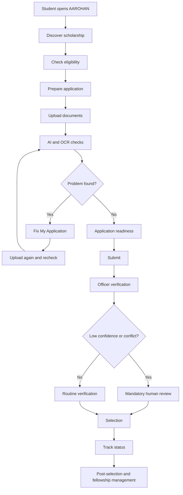
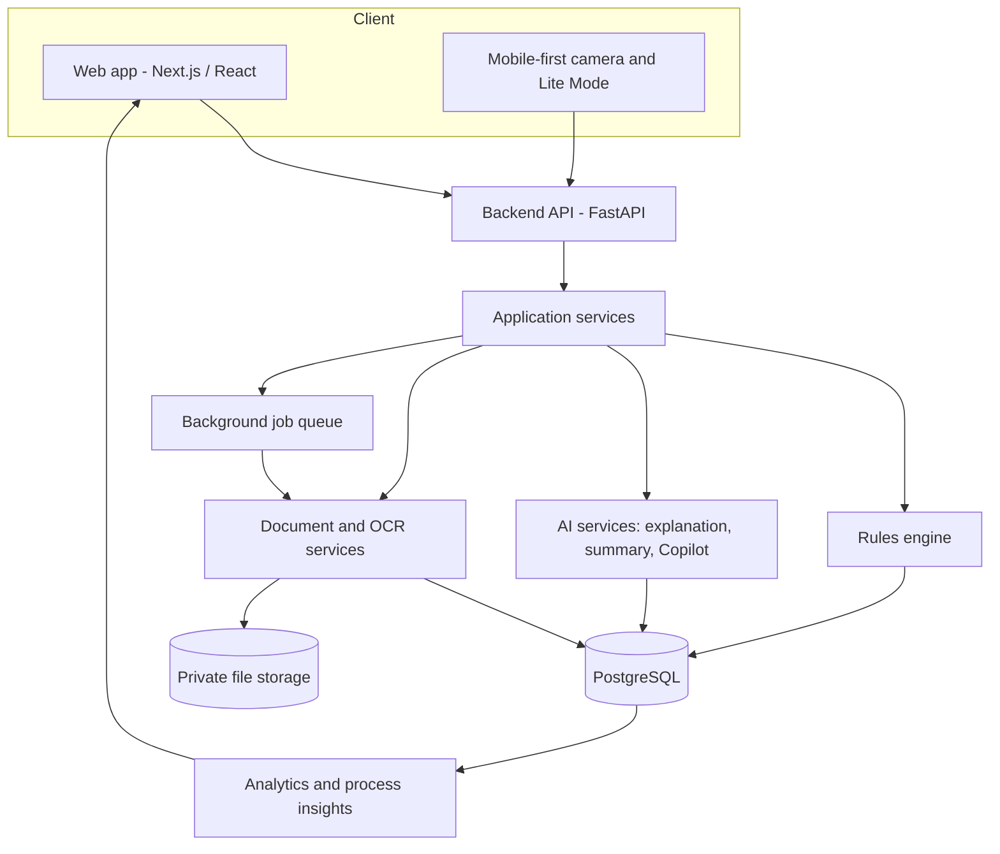
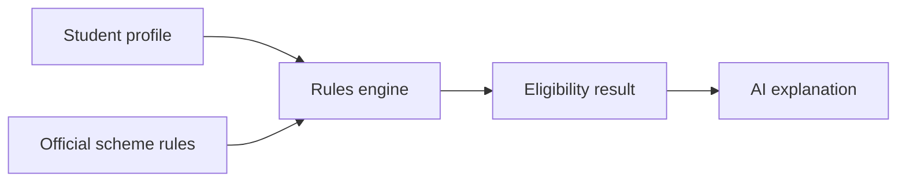
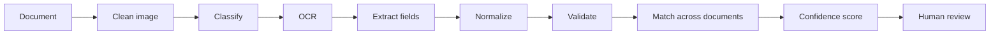
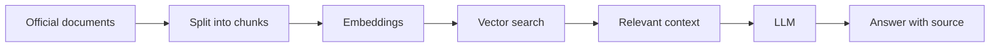
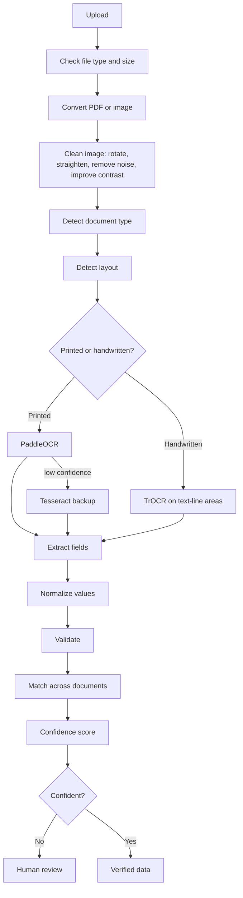
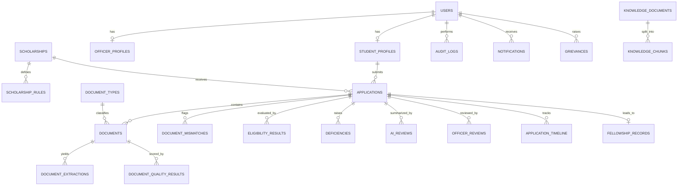

<div align="center">
# AAROHAN
 
### Rise Beyond. Reach Further.
 
**AI-Powered Scholarship & Fellowship Platform for Scheduled Tribe Students**
 
Smart India Hackathon 2026 · Problem Statement **SIH26239** · Ministry of Tribal Affairs
 


 
</div>

## Contents
 
[Overview](#2-project-overview) · [Problem](#3-the-problem) · [Solution](#4-our-solution) · [Innovation](#5-core-idea) · [Features](#6-key-features) · [Journey](#7-user-journey) · [Roles](#8-who-uses-it) · [Architecture](#9-technical-architecture) · [Tech Stack](#10-technology-stack) · [AI](#11-how-we-use-ai) · [OCR](#12-ocr-and-document-checking) · [Eligibility](#13-explainable-eligibility) · [Readiness](#14-application-readiness) · [Fix My Application](#15-fix-my-application) · [Human Review](#16-humans-stay-in-charge) · [Security](#17-security-and-privacy) · [Database](#18-database) · [API](#19-api) · [Structure](#20-project-structure) · [Team](#21-team) · [SIH Info](#22-sih-information) · [Demo](#23-demo-flow) · [Difference](#24-why-aarohan-is-different) · [Status](#25-current-status) · [Setup](#26-setup) · [Env](#27-environment-variables) · [Testing](#28-testing) · [Future](#29-future-scope) · [Limits](#30-limitations) · [Vision](#31-our-vision)
 
---
 
## 2. Project Overview
 
**AAROHAN** is a scholarship and fellowship platform for Scheduled Tribe (ST) students. It helps students, verifying officers and the Ministry of Tribal Affairs. It covers the full journey in the problem statement: application, document upload, eligibility check, scrutiny, selection, communication, and support after selection.
 
AAROHAN does **not** replace the National Scholarship Portal. It sits on top as a helper. It guides students, checks documents, and supports officers in their decisions.
 
**The student journey**
 
> Discover → Understand → Prepare → Verify → Apply → Fix → Track → Succeed
 
**Our main idea**
 
> *Don't just process scholarship applications. Prevent application failures before submission.*
 
| Who | How AAROHAN helps |
|---|---|
| **Students** | Find the right scholarship, understand the rules, fix document problems before submitting, and track the application in their own language. |
| **Officers / Verifiers** | See a short AI summary, the extracted data, proof and confidence for every case. Less repeated manual work. |
| **Ministry / Admin** | See where applicants get stuck, which problems repeat, and how to improve the process. |
 
---
 
## 3. The Problem
 
Many eligible students miss scholarships or lose time because of avoidable problems.
 
| Problem | What happens |
|---|---|
| Hard to find the right scholarship | Eligible students never apply |
| Eligibility rules are unclear | Students apply wrongly or give up |
| Documents are missing, blurry, wrong or expired | Deficiency notices and delays |
| Names or dates do not match across documents | Extra rounds of checking |
| Officers check the same things by hand | Heavy workload, slow results |
| Status only says "Processing" | Students worry and keep asking |
| Language and internet problems | Students in remote areas are left out |
| The Ministry cannot see where the process fails | Same problems repeat every year |
| Little help after selection | Renewals and reports are missed |
 
These match the official problem statement: AI and document intelligence, eligibility checks, human oversight, communication, and end-to-end management after selection.
 
---
 
## 4. Our Solution
 
AAROHAN has four parts. They work as one flow, not as separate tools.
 
| Part | What it includes |
|---|---|
| **Discover & Understand** | Scholarship finder, matching, clear eligibility, readiness score, application help |
| **Prepare & Verify** | Document reading (OCR), document type detection, quality check, mismatch detection, problem fixing |
| **Review & Track** | Officer review with AI help, case summary, human checks, status timeline, messages |
| **Access & Improve** | Many languages, accessibility, low-internet mode, Ministry analytics, process insights, post-selection support |
 
**How they connect:** eligibility and document results create the *readiness score*. Problems found become *Fix My Application* steps. Verified proof feeds the *officer's case summary*. Officer results and repeated problems feed *Ministry analytics*. The analytics create *advice to improve the process*, which helps future students.
 
---
 
## 5. Core Idea
 
> **Prevent scholarship application failures before they happen.**
 
Most systems find problems **after** the student submits. AAROHAN finds them **before**.
 
```
Detect  →  Explain  →  Fix  →  Recheck
```
 
Problems we catch early: missing document · blurry document · wrong document type · expired document · name mismatch · date of birth mismatch · incomplete form · missing signature · missing page.
 
For each problem, AAROHAN tells the student what went wrong, why, and exactly how to fix it.
 
---
 
## 6. Key Features
 
| Feature | What it does | Who benefits |
|---|---|---|
| Scholarship Discovery | Shows schemes that match the student, with reasons | Student |
| Explainable Eligibility | Checks each rule and shows the result with proof | Student, Officer |
| Scholarship Readiness | Gives a clear "application readiness estimate" | Student |
| Application Assistance | Guided form with help on each step | Student |
| AI Document Intelligence | Full pipeline to read and check documents | Student, Officer |
| OCR | Reads printed, handwritten and multilingual text | Student, Officer |
| Document Classification | Detects what type of document was uploaded | Student, Officer |
| Document Quality Check | Scores blur, brightness, crop, glare, rotation | Student |
| Structured Data Extraction | Pulls fields with confidence, page and location | Officer |
| Mismatch Detection | Flags possible differences between documents | Student, Officer |
| Deficiency Resolution | Tracks problems and re-submission | Student, Officer |
| Fix My Application | Detect, explain, fix, recheck | Student |
| Human-in-the-Loop Verification | Sends unsure cases to officers | Officer |
| AI-Assisted Officer Review | Shows evidence and a suggested next step | Officer |
| AI Case Summary | One-screen summary of a case | Officer |
| Transparent Tracking | Timeline in plain language | Student |
| Scholarship Copilot | Assistant that knows the student's own application | Student |
| RAG Information Assistant | Answers only from official documents, with sources | Student |
| Multilingual Support | English and Hindi first, more languages later | Student |
| Accessibility | Keyboard use, screen readers, high contrast, text size | Student |
| Voice Assistance | Optional voice input and output | Student |
| Low-Bandwidth Mode | Small uploads, retry queue, local drafts | Student |
| Mobile Document Scanning | Camera capture, crop, rotate, quality check | Student |
| How-to-Apply Guidance | Short videos, steps, common mistakes, FAQs | Student |
| Deadline Intelligence | Calendar and reminders using official dates only | Student |
| Notifications | In-app, email and SMS through a provider layer | All |
| Grievance Workflow | Report, track and resolve issues | Student, Officer |
| Post-Selection Management | Award details, renewals, reports, milestones | Student, Ministry |
| Ministry Analytics | Funnel, state and district trends, KPIs | Ministry |
| Process Intelligence | Turns repeated problems into advice | Ministry |
| Deficiency Intelligence | Groups deficiency and rejection reasons | Ministry |
| Audit Logs | Records every important action | Officer, Ministry |
| Security & Role-Based Access | Each role sees only what it needs | All |
 
**Proposed extensions (all Planned):** DigiLocker and API Setu checks, QR code and digital signature checks, tamper-suspicion signals, duplicate claim detection across schemes, an NSP sync and PFMS/DBT payment **simulator**, and a Flutter offline-first mobile app with Sarvam AI voice. These signals never accuse a student. They only send the case to a human.
 
---
 
## 7. User Journey
 

 
---
 
## 8. Who Uses It
 
| Role | Main screens | What they can do |
|---|---|---|
| **Student / Applicant** | Dashboard, Finder, Document Center, Readiness, Copilot | Find schemes, check eligibility, upload or scan documents, fix problems, submit, track, raise grievances, manage tasks after selection |
| **Officer / Verifier** | Verification queue, case file, evidence viewer | See the queue, inspect documents and OCR results, read the AI summary, approve, reject, ask for correction, escalate, add notes |
| **Ministry / Admin** | Analytics, scheme and rules management, audit logs | See KPIs and trends, find bottlenecks, set scheme rules, view the audit trail, monitor the system |
 
Each role has its own screens and its own permissions.
 
---
 
## 9. Technical Architecture
 

 
**Why this design:** the UI has no business logic, rules are stored in the database, and slow work (OCR) runs in the background so the screen never freezes.
 
---
 
## 10. Technology Stack
 
"Planned" means the technology is our target. Change it to "Implemented" only after checking the code.
 
| Layer | Technology | Purpose | Status |
|---|---|---|---|
| Frontend | Next.js, React, TypeScript | User interface | Planned (verify) |
| Styling | Tailwind CSS | Design system | Planned (verify) |
| Backend | Python, FastAPI | APIs and AI services | Planned (verify) |
| Database | PostgreSQL | Relational data | Planned (verify) |
| Storage | Supabase Storage or S3-compatible | Private documents | Planned |
| OCR | PaddleOCR | Printed and multilingual text | Planned |
| OCR fallback | Tesseract | Backup OCR | Planned |
| Handwriting | TrOCR | Handwritten text | Planned |
| Image processing | OpenCV, Pillow | Clean up images before OCR | Planned |
| AI | Configurable LLM provider (Gemini, OpenAI or similar) | Explanations, summaries, Copilot | Planned |
| RAG | pgvector | Search official documents | Planned |
| Mobile app | Flutter, SQLite | Offline-first app | Proposed |
| Voice | Sarvam AI | Indian-language voice | Proposed |
 
---
 
## 11. How We Use AI
 
**One simple rule: the AI never decides eligibility.**
 
```
AI            → reads, explains, classifies, summarizes
Rules engine  → decides eligibility
Human officer → makes the final decision
```
 
**Eligibility**
 

 
**Documents**
 

 
**Scholarship Copilot (RAG)**
 

 
**Copilot rules**
- Use only the retrieved official information.
- Never invent eligibility rules, deadlines or amounts.
- Never approve or reject an application.
- If unsure, say: *"I couldn't verify this from the available official information."*
- If document checking is unsure, ask for human review.
**Why this is better:** rules can be audited, answers come with sources, uncertainty is visible, and humans keep the final say.
 
**Demo AI Mode:** if no AI service is available, the app uses fixed sample outputs so the demo still works. These are always labelled as demo data.
 
---
 
## 12. OCR and Document Checking
 

 
| Tool | Job |
|---|---|
| **PaddleOCR** | Main OCR for printed and multilingual text, with text boxes |
| **Tesseract** | Backup OCR and language-specific reading |
| **TrOCR** | Handwritten text, used only on cropped handwriting lines |
| **OpenCV** | Straighten, fix perspective, remove shadows, improve contrast |
| **Pillow** | Resize, convert and compress images |
 
**Good to know**
- The original document is never changed. We store the cleaned OCR copy separately.
- Every extracted field has a **value, confidence, page, box location and method**.
- The quality score checks blur, size, brightness, contrast, crop, glare, shadows, rotation and duplicate pages. It always shows the reason for the score.
- The OCR engine sits behind one service (`OCRService`), so any engine can be swapped later.
---
 
## 13. Explainable Eligibility
 
Eligibility comes from **official rules stored in the database**. It does not come from an AI guess, and it is not hardcoded in the UI.
 
| Requirement | Your information | Result | Proof |
|---|---|---|---|
| ST category | ST | ✓ | Category certificate |
| Academic qualification | Eligible course | ✓ | Marksheet |
| Income limit | Within limit | ✓ | Income certificate |
| Course | Eligible course | ✓ | Application |
 
Every result tells the student:
1. What we checked
2. Why they seem eligible or not
3. What is still missing
4. What to do next
If a rule is not met, we say so kindly. We show the requirement, the student's value, and other schemes that may fit. We never invent rules.
 
---
 
## 14. Application Readiness
 
**Application Readiness: 86%**
*This is an estimate to help the student. It is not government approval.*
 
| Factor | Question |
|---|---|
| Eligibility completeness | Do we have all information needed for the rules? |
| Document completeness | How many required documents are uploaded? |
| Document quality | Are documents clear and complete? |
| Profile consistency | Do names and dates match across documents? |
| Application completeness | Is the form fully filled? |
 
The score is calculated in the open from these five factors, and each factor is shown. It answers one question: *"If I submit now, how likely am I to face an avoidable deficiency?"*
 
---
 
## 15. Fix My Application
 
```
Detect → Explain → Fix → Recheck
```
 
**Example**
 
- **Problem:** Your income certificate could not be verified with confidence.
- **Why:** The photo is partly blurred.
- **How to fix:**
  1. Retake the photo in good light.
  2. Keep the whole page in view.
  3. Avoid shadows.
  4. Upload a clear image or PDF.
- **Upload again:** Checks run again by themselves and the readiness score updates.
---
 
## 16. Humans Stay in Charge
 
AI helps officers. It does not replace them.
 
| AI confidence | What happens |
|---|---|
| High | Routine verification queue |
| Medium | Officer review |
| Low, or documents conflict | Mandatory human review |
 
For every case, an officer can see:
- the original document
- the OCR text
- the extracted fields and confidence
- the page and box location of each value
- the rule that was used
- all earlier actions
Differences between documents are shown as **"Potential inconsistency – human review required"**. We never call it fraud.
 
---
 
## 17. Security and Privacy
 
| Area | What we do |
|---|---|
| Access | Role-based access, least privilege |
| Login | Secure sessions or tokens, safe password hashing |
| Authorization | Checked on every API call |
| Documents | Private storage and short-lived signed links |
| Uploads | File type and size checks, malware-scan hook |
| Network | HTTPS only |
| Abuse | Rate limiting and input validation |
| Secrets | Kept in environment variables, never in frontend code |
| Accountability | Audit log for important actions |
| Data | Only needed personal data. Demo mode uses fake data only |
 
---
 
## 18. Database
 
Main tables: `users`, `roles`, `student_profiles`, `officer_profiles`, `scholarships`, `scholarship_rules`, `eligibility_rules`, `applications`, `application_steps`, `documents`, `document_types`, `document_extractions`, `document_quality_results`, `document_mismatches`, `eligibility_results`, `deficiencies`, `notifications`, `grievances`, `audit_logs`, `ai_reviews`, `officer_reviews`, `application_timeline`, `fellowship_records`, `knowledge_documents`, `knowledge_chunks`, `system_settings`.
 

 
---
 
## 19. API
 
This is the target design. Mark a route **Implemented** only after you confirm it exists.
 
| Route | Purpose | Status |
|---|---|---|
| `/auth`, `/users`, `/students` | Login and profiles | Planned |
| `/scholarships`, `/scholarships/{id}` | Find and view schemes | Planned |
| `/eligibility/check` | Rule-based eligibility | Planned |
| `/applications`, `/applications/{id}` | Applications | Planned |
| `/applications/{id}/readiness` | Readiness score | Planned |
| `/documents/upload` | Upload and start processing | Planned |
| `/documents/{id}/ocr`, `/verify`, `/quality`, `/mismatch` | Document checks | Planned |
| `/ai/chat`, `/ai/case-summary` | Copilot and officer summary | Planned |
| `/notifications`, `/grievances` | Messages and complaints | Planned |
| `/admin/applications`, `/admin/analytics`, `/admin/audit-logs` | Officer and Ministry tools | Planned |
 
---
 
## 20. Project Structure
 
This is the target layout. Replace it with your real folders (run `tree /F` in PowerShell).
 
```
frontend/       Web app: pages, components, features, translations
backend/        FastAPI app: api, models, schemas, services, rules, ai, ocr, workers
database/       Migrations and seed data
docs/           Architecture, API, AI and demo notes
tests/          Unit, integration and end-to-end tests
demo_assets/    Fake demo documents and data
```
 
---
 
## 21. Team

| Role | Name | Technical Contribution |
|---|---|---|
| **Team Leader** | **Divya** | AI/ML, System Architecture, End-to-End Integration & Team Coordination |
| **AI/ML Engineer** | **Sara Sahni** | OCR, Document Intelligence & AI-based Document Verification |
| **AI/ML Engineer** | **Rishabh Kumar Singh** | Eligibility Intelligence, Application Readiness & AI-assisted Analysis |
| **Backend Engineer** | **Ayush Kumar Gupta** | Backend APIs, Database Design & Application Workflow |
| **Backend Engineer** | **Shubham Raj** | Backend Services, API Integration & System Workflow |
| **AI/ML Engineer** | **Vyom Soni** | OCR, NLP, Information Extraction & Document Mismatch Detection |
 
---
 
## 22. SIH Information
 
| Field | Details |
|---|---|
| Hackathon | Smart India Hackathon 2026 |
| Problem Statement ID | SIH26239 |
| Organization | Ministry of Tribal Affairs |
| Theme | Smart Education |
| Category | Software |
| Project | AAROHAN |
| Type | AI-powered Scholarship & Fellowship Platform |
 
---
 
## 23. Demo Flow
 
1. A student opens AAROHAN and picks a language.
2. The student finds a matching scholarship.
3. The student checks eligibility and sees every rule explained.
4. The student starts the application.
5. The student uploads documents.
6. OCR reads them and extracts the fields.
7. The system finds a name mismatch.
8. **Fix My Application** explains what happened and how to fix it.
9. The student uploads a corrected document.
10. Readiness goes up (for example, to 96%).
11. An officer opens the case and sees the AI summary, proof, confidence and timeline.
12. A low-confidence document goes to mandatory human review.
13. The Ministry dashboard shows the most common application problems.
14. Process intelligence suggests a fix, such as clearer income-certificate guidance.
All demo data is fake. Demo users: Demo Student, Demo Officer, Demo Ministry Admin.
 
---
 
## 24. Why AAROHAN Is Different
 
| What we do | Why it matters |
|---|---|
| Scholarship Readiness | Students know their chances before submitting |
| Explainable Eligibility | Students see reasons, not just "eligible" |
| Preventive Document Checks | Problems are caught early |
| Fix My Application | Clear steps to correct mistakes |
| Confidence-aware Human Review | Unsure cases always reach a human |
| Evidence-based Officer Review | Every AI suggestion links to proof |
| Deficiency Intelligence | Repeated problems are counted and grouped |
| Process Intelligence | Bottlenecks turn into advice |
| Multilingual and Accessible UX | More students can use it |
| Low-Bandwidth Support | Works with weak internet |
| Post-Selection Journey | Help continues after selection |
 
**From application processing to application readiness.**
 
---
 
## 25. Current Status
 
Update this table from your real code.
 
| Feature | Status |
|---|---|
| Scholarship discovery and eligibility | Planned (verify) |
| Rules engine stored in database | Planned (verify) |
| Application form and drafts | Planned (verify) |
| Document upload | Planned (verify) |
| OCR (PaddleOCR, Tesseract, TrOCR) | Planned (verify) |
| Quality score and mismatch detection | Planned (verify) |
| Readiness score and Fix My Application | Planned (verify) |
| Officer queue and case file | Planned (verify) |
| Audit logs and timeline | Planned (verify) |
| Ministry analytics and process insights | Planned (verify) |
| Copilot and RAG | Planned |
| English and Hindi | Planned (verify) |
| Voice, Lite Mode, mobile scanning | Planned |
| Post-selection management | Planned |
| DigiLocker, tamper signals, duplicate checks, PFMS simulator, Flutter app | Proposed |
 
**Implemented:** _fill in_ · **In Progress:** _fill in_ · **Planned:** the rest.
 
---
 
## 26. Setup
 
These commands are a template for Windows PowerShell. Change them to match your real scripts.
 
**You need:** Git, Node.js 20+, Python 3.11+, PostgreSQL 15+ (with pgvector for RAG), and Tesseract installed and added to `PATH`.
 
```powershell
# 1. Get the code
git clone <your-repository-url>
cd <repository-folder>
 
# 2. Backend
cd backend
python -m venv .venv
.\.venv\Scripts\Activate.ps1
pip install -r requirements.txt
Copy-Item ..\.env.example ..\.env    # then edit .env
uvicorn app.main:app --reload --port 8000
 
# 3. Frontend (open a new terminal)
cd frontend
npm install
npm run dev
```
 
**Database:** create a PostgreSQL database, set `DATABASE_URL`, run the migrations (for example `alembic upgrade head`), then load demo data from `database/seeds`.
 
**OCR:** PaddleOCR and TrOCR download their models the first time they run, so you need internet once. If they are missing, the system falls back to Tesseract.
 
**AI:** set `AI_API_KEY`. If you leave it empty, the app runs in **Demo AI Mode**.
 
**Build:** `npm run build`
 
---
 
## 27. Environment Variables
 
Copy `.env.example` to `.env`. Never commit real values.
 
| Variable | What it is for |
|---|---|
| `DATABASE_URL` | PostgreSQL connection |
| `AI_API_KEY` | AI provider key (backend only) |
| `STORAGE_URL` | File storage address |
| `STORAGE_KEY` | File storage key |
| `AUTH_SECRET` | Signs login sessions or tokens |
| `OCR_SERVICE_URL` | OCR service address, if run separately |
| `EMAIL_API_KEY` | Email provider key for notifications |
 
---
 
## 28. Testing
 
| Type | What it covers | Status |
|---|---|---|
| Unit | Eligibility rules, normalization, scoring, validation | Planned (verify) |
| Integration | Upload, OCR pipeline, submission, officer workflow | Planned |
| UI / End-to-end | Login, eligibility, upload, submission, tracking | Planned |
| Security | Unauthorized access, role escalation, document access | Planned |
 
```powershell
cd backend; pytest
cd frontend; npm test
```
 
---
 
## 29. Future Scope
 
- More Indian languages
- Better voice assistance
- Stronger anomaly detection
- More scholarship schemes
- Richer analytics
- Better offline support
- Improved document models
- Links to other government systems, only where officially allowed
---
 
## 30. Limitations
 
AAROHAN is a **hackathon prototype**. It is not ready for production use.
- Demo data is fake.
- OCR accuracy depends on document quality and language.
- The readiness score is an estimate, not an approval.
- Government integrations are simulated or proposed unless officially allowed and built.
- The system supports officers. It never replaces them.
---
 
## 31. Our Vision
 
> AAROHAN aims to make scholarship access simpler for students, verification more efficient for officials, and decision-making more transparent for the Ministry.
 
**Discover → Understand → Prepare → Verify → Apply → Fix → Track → Succeed**
 
**Prevent scholarship application failures before they happen.**
 
